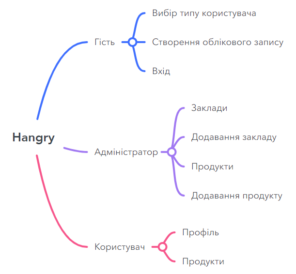
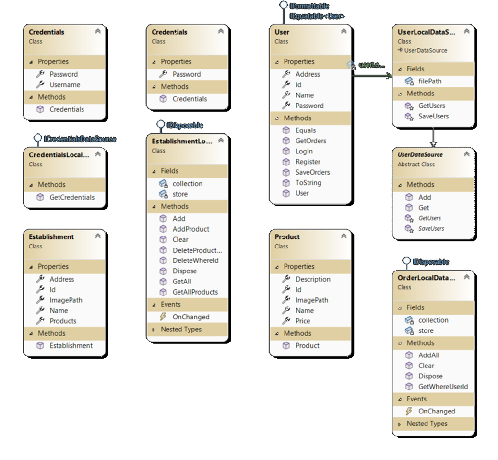
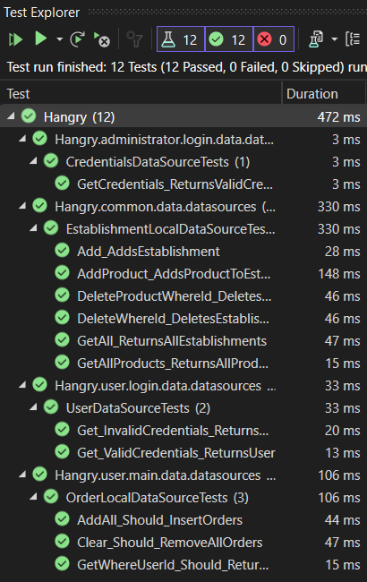

# Hangry

## Актуальність курсової роботи

Послуги доставки їжі стали наріжним каменем сучасного життя, пропонуючи переваги, які виходять за рамки простої зручності, що полягає у відсутності потреби готувати. У міру того, як ми долаємо складнощі сучасного життя – від тривалого робочого дня до постійної потреби в соціальному дистанціюванні в деяких регіонах – попит на послуги доставки їжі продовжує зростати.

У 2023 році обсяг світового ринку онлайн-доставки продуктів харчування оцінювався в понад один трильйон доларів США, з яких 640 мільярдів доларів припадало на сегмент доставки продуктів, а 390 мільярдів доларів – на сегмент доставки страв[1].

Цільовою аудиторією сервісів доставки їжі є насамперед молоді люди від 18 до 40 років, особливо технічно підковані міленіали, які ведуть активний спосіб життя, які не мають часу ходити за продуктами або готувати їжу, але при цьому хочуть споживати здорову та якісну їжу.

Згідно з даними, більшість користувачів Uber Eats (74,5%) належать до вікової групи від 18 до 44 років. Найбільший сегмент – це користувачі віком від 25 до 34 років, на яких припадає 32,3% від загальної кількості користувачів Uber Eats у світі. Другий за величиною сегмент – це наймолодші користувачі, віком від 18 до 24 років, їх 22,9%. Потім йдуть старші користувачі, які рідше користуються цим сервісом: від 35 до 44 років (19,3%) та всі інші вікові групи разом – близько 25,5%[2].

### Лідери ринку доставки їжі:

- **Uber Eats** – найдоступніший сервіс доставки їжі, що працює на шести континентах.
- **Just Eat** – лідер доставки їжі у Великій Британії, активно працює в Європі та Австралії.
- **DoorDash** – поточний лідер онлайн-доставки їжі в США, який також є піонером моделі “платформа-споживач”[3].

Для розробки застосунку будуть використані мова програмування C# та фреймворк для створення графічного інтерфейсу користувача Windows Forms.

### Об’єкт дослідження

Технології створення комп’ютерних застосунків за допомогою Windows Forms.

### Предмет дослідження

Розробка системи для замовлення їжі засобами Visual Studio.

## Mind Map сервісу

## Діаграма класів предметної області

## Результат Unit-тестування

